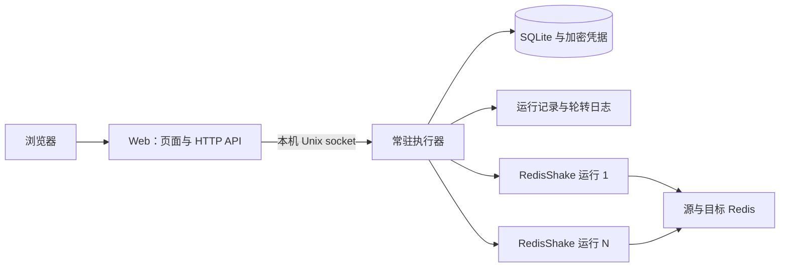

# 进程、初始化与部署设计

更新日期：2026-09-23  
状态：主要进程、初始化与部署流程已实现，并完成原生 macOS/arm64 与 Docker Linux/amd64 冒烟；详情见 [验证记录](verification.md)。容量参数仍是初始目标，不是性能实测结果。

## 1. 设计约束

- Web 重启不能中断 RedisShake 的全量或增量同步；浏览器关闭也不影响任务。
- 执行器或 RedisShake 故障后不自动重新全量，不支持断点恢复。
- 只部署到执行器可直接访问源端、目标端及发现节点的网络，不提供 SSH 隧道、远程 Agent 或分布式调度。
- 本机解压后执行一个命令启动；Docker 和本机采用同一套状态与配置语义。
- 页面不提供性能调节；执行参数使用统一工程默认值。

## 2. 职责与数据归属



使用 Go 实现 Web、执行器及适配模块，SQLite 持久化；Web 内嵌原生 HTML/CSS/JavaScript 静态资源。一个可执行文件提供 Web、执行器和单任务内核子命令；每个迁移任务由独立子进程运行固定版本的 RedisShake 内核代码。

- **Web**：服务静态页面、处理 HTTP 输入、返回查询结果和事件流。只通过执行器执行认证、配置持久化和任务控制；自身不管理 RedisShake PID，不直接写数据库。
- **执行器**：数据目录单实例锁；日常业务数据的 SQLite 写入方；负责管理员、会话、连接、任务、运行快照、预检、进程控制、清理及日志。维护命令也会短暂访问数据库。
- **RedisShake**：每次运行独立工作目录与配置，使用 `sync_reader + redis_writer` 完成全量加增量；不向浏览器开放管理或指标端口。
- **进程连接**：本地 Unix socket，限制目录和文件权限；协议包含版本，Web 与执行器不兼容时显示原因并拒绝控制，不自动替换运行中的执行器。

执行器持续排空内核日志并独立采集状态，Web 断开不会堵塞同步输出。浏览器事件流只消费执行器的有界队列，不成为数据迁移链路的一部分。

## 3. Web 重启与重新接管

1. Web 退出时只关闭 HTTP 监听与本地 RPC 连接，不向执行器发送停止任务的命令。
2. 执行器持续管理原有 RedisShake 进程、落盘日志、更新阶段与运行事件。
3. 新 Web 进程读取相同数据目录的控制 socket，核对协议版本和执行器身份。
4. 页面重新获取任务快照及最后事件序号；使用序号续读状态，历史事件已淘汰时重新拉取完整快照。
5. 浏览器发出但未得到结果的启动、停止、清理请求，按原请求编号查询结果，不另行执行。

“接管”指恢复访问同一个执行器；Web 不重新启动或重新认领内核子进程。执行器不可达时显示“执行器暂不可用”和最近采样时间，禁止启动、重跑及清理，不把缓存状态显示成当前正常运行。

## 4. 故障边界

| 事件 | 既有同步 | 恢复动作 |
| --- | --- | --- |
| 关闭浏览器、注销、会话过期 | 持续运行 | 重新登录查看 |
| Web 正常退出或崩溃 | 持续运行 | 重启 Web 并连接原执行器 |
| 仅重启 Docker 的 Web 服务 | 持续运行 | Web 重连 |
| RedisShake 意外退出、复制连接失败 | 当前运行失败 | 用户处理原因后发起新全量 |
| 执行器主动关闭 | 先停止并回收内核，再退出 | 重启服务后由用户新全量 |
| 执行器崩溃或被强制结束 | 终止其内核，停止写入；不自动恢复 | 新执行器核对旧运行后标记失败 |
| 执行器容器、整个 Docker 部署或整机重启 | 不承诺保留同步 | 标记中断，用户新全量 |
| 源/目标故障切换或拓扑变化 | 不承诺无缝继续 | 检测到影响运行的变化则报错停止，重新预检 |

### 防止孤儿进程与重复写入

- 执行器启动前取得数据目录独占锁，不允许第二个执行器并行控制同一目录。
- 每次运行保存随机运行 ID、执行器实例 ID、进程 PID、启动身份与配置摘要；不能仅凭 PID 判断归属，避免误杀复用该 PID 的其他进程。
- 为跨 Linux/macOS 保证执行器崩溃后内核不长期独自写入，拟使用受控父进程存活管道：执行器持有写端，内核监视只读端；EOF 触发失败退出。内核新增可选开关，普通上游使用方式不启用。属于已允许的小补丁，P1 必须先验证。
- 存活管道由执行器持有，不能由 Web 持有；也不能被其他子进程继承而阻止 EOF。
- 内核监视器检测到父进程消失后先取消运行，再在有限宽限期结束进程；初始上限 15 秒。验证 SIGKILL、阻塞 I/O 和各平台句柄继承。
- 新执行器先核对残留运行和身份，确认旧进程终止后才允许相同任务重新全量。无法确定归属或终止结果时标记为待核对，保留锁并显示处理入口，不猜测为已停止。
- 若固定内核无法通过小补丁满足这一故障语义，应在 P1 提交证据和替代方案，不能静默改成 Web 与内核一起退出。

## 5. 持久化与操作事务

SQLite 保存以下逻辑实体，表结构在实现任务中落实：

| 实体 | 关键字段与约束 |
| --- | --- |
| 管理员/会话 | 唯一管理员、密码哈希、会话摘要、过期时间、认证版本 |
| 连接 | ID、配置版本、类型、地址、认证密文、最近测试记录 |
| 任务 | ID、配置版本、名称、源/目标连接引用、DB/Key/命令规则、目标策略 |
| 运行 | ID、任务 ID、不可变配置快照、内核制品摘要、状态、阶段、进程身份、错误与时间 |
| 控制操作 | 请求 ID、操作类型、输入摘要、执行阶段、结果或不确定原因 |
| 运行事件 | 单调序号、运行 ID、状态变化、阶段、故障与采样时间 |
| 清理操作 | 目标身份、配置版本、DB/节点列表、确认摘要、逐节点执行与结果 |

启动、停止、删除和清理都由执行器裁决关键状态，并使用数据库约束保护“同任务最多一个活跃运行”。当前全局并发上限固定为 5，达到上限直接返回原因，不隐式排队；启动与清理还会检查目标实例是否被其他活跃任务占用。清理确认令牌只能执行一次。

启动顺序为：核对版本及权限 → 预检 → 保留并发/目标操作名额 → 写入启动意图和配置快照 → 拉起内核 → 保存进程身份。任一阶段失败记录原因；崩溃窗口通过启动意图和进程身份核对，不盲目重复拉起。

幂等请求 ID 绑定操作类型与输入摘要；同 ID 不同参数报冲突，同 ID 相同参数返回原结果。尤其清理命令发送后响应丢失时，结果应标为不确定，禁止自动重发。管理员明确发起新操作，才可再次清理。

任务更新和连接更新使用配置版本进行乐观并发校验。每次运行固定当时的连接及规则，运行中不热改；Web 更新不修改运行快照。历史连接凭据仍加密且不通过查询接口回显。

## 6. 首次初始化与登录

以下为工程默认规则，不要求用户额外选择技术参数：

1. 空数据目录首次启动时，Web 显示管理员账号初始化页；启动命令只显示访问地址。
2. 未初始化 Web 只允许访问初始化页、初始化状态和必要健康检查，其余管理接口禁止访问。
3. 初始化页预填账号 `admin`、密码与确认密码 `RedisShake@123456`，允许提交前修改；只有用户点击创建后才写入数据库。账号需为 3～32 位，以字母开头，仅含字母、数字和下划线；密码不能为空，最多 128 个字符，服务端再次校验。
4. 执行器创建唯一管理员；数据库单行约束确保并发提交只有一个成功。
5. 初始化完成返回登录页，以新密码登录；关闭初始化接口。登录页不提供忘记密码入口。

首次设置由第一个成功提交的浏览器完成；默认 Web 仅监听本机，远程部署时须先限制访问范围。旧数据目录中固定用户名 `admin` 的管理员会自动迁移，原密码保持不变。

密码使用 Argon2id 哈希；会话采用不可预测的随机令牌，服务端保存摘要，浏览器使用 HttpOnly、SameSite=Strict Cookie。当前会话绝对时长为 7 天，不单独设置空闲超时；登录按执行器实例做每分钟失败 10 次限速，注销销毁会话，修改密码后撤销所有旧会话。状态更改接口校验 CSRF 令牌。

界面不提供账号入口或密码修改页面；后端保留需已登录且校验 CSRF 的密码修改接口。不提供设置页、忘记密码页面、重置接口或一次性重置码维护命令。

Redis 凭据在执行器中用本地密钥加密，数据目录权限限制为操作者可访问；密钥和数据库均须备份。生成的内核 TOML 只能由执行器账户读取，退出后删除明文运行配置，历史快照保留加密形式。错误与日志出口按已知凭据脱敏，不记录认证请求体或完整 Redis 命令参数。

Web 默认本机 HTTP 访问；服务器的 HTTPS 由反向代理终止，受信代理地址需显式配置。Redis 连接不启用 TLS 是本版范围，和浏览器到 Web 的 HTTPS 配置分别处理。

## 7. 本机发布与启动

发布包包含：一个集成 Web、执行器与 RedisShake 内核的程序、版本清单与校验值、许可文件及中文说明。界面资源内嵌，无需用户安装 Node.js、Go 或 SQLite 服务。

建议命令约定：

```sh
./redis-shake-web serve
```

- 默认数据目录为当前用户目录下 `.redis-shake-web`，可通过 `--data-dir` 显式指定；首次选定后重启需继续使用同一目录。
- `serve` 检查同目录执行器：存在且兼容则复用，否则启动与终端会话分离的执行器，再启动前台 Web。退出前台 Web 保留执行器和任务。
- 默认 Web 监听 `127.0.0.1:8080`，打印访问地址；通过 `--listen` 显式修改。端口占用时打印可操作错误，不悄悄随机改端口。
- 首次启动打印 Web 访问地址；浏览器按管理员是否存在展示初始化页或登录页。
- `status` 显示 Web/执行器状态和活跃运行数；`shutdown` 明确停止整个服务，先终止并回收运行再退出执行器。中断前台 Web 与停止整个服务在启动输出和帮助中分别说明。
- 升级默认先手动停止任务与执行器、备份数据目录，再更换发布包。仅同版本/兼容协议的 Web 重启保证任务连续；不把“Web 重启不影响同步”扩大成“任意升级不中断”。

Linux/macOS × x86_64/ARM64 均需真机或相应 CI runner 验证；构建成功不能代替启动、独立进程和故障测试。最低系统版本在 P1 固定依赖后写入发布清单，不能只依据开发机推定。

## 8. Docker 交付

同一个多架构镜像提供 `web` 和 `runner` 子命令；官方 Compose 文件包含两个服务：

- `runner` 独占持久化数据卷和 Redis 网络访问；每个迁移任务以同一程序的内部 `task` 模式运行在独立子进程中。
- `web` 通过共享的本地控制 socket 卷访问执行器，仅开放 Web 端口。数据卷不直接挂给 Web。
- 对齐运行 UID 和 socket 权限；容器健康检查分别判断 Web 和执行器，Web 就绪要求执行器协议匹配。
- `docker compose restart web` 保留 runner 和同步；`docker compose down` 或重启 runner 会中断同步。
- 服务可以由容器管理器重新启动，但失败的迁移运行不会自动重启；runner 启动时执行状态核对。
- 交付 linux/amd64、linux/arm64；内核代码编入同一镜像与可执行文件，运行时不从网络下载替换内核。

## 9. 必须验证的场景

| 编号 | 操作与预期 |
| --- | --- |
| RT-01 | 首次初始化校验账号和密码，重复及并发提交不能创建第二个管理员；旧数据目录管理员仍可登录。 |
| RT-02 | 本机一个命令首次启动可用；再次启动复用执行器，无重复内核。 |
| RT-03 | 全量过程中终止 Web，执行器/内核身份及复制会话不变；Web 重启后继续观察同一次运行。 |
| RT-04 | 增量期间重启 Web，源端持续更新；重连后的事件、日志和工程数据比对无漏项。 |
| RT-05 | 原生和 Docker 分别验证 Web-only 重启与整个部署重启的不同结果。 |
| RT-06 | 执行器正常退出、崩溃和 SIGKILL：内核在宽限期内退出，无残留写入；重启后不自动全量。 |
| RT-07 | 在记录启动意图前后、拉起内核前后分别注入崩溃；不能出现两个相同任务进程。 |
| RT-08 | 模拟 PID 复用、失联、残留目录和协议不匹配，不误杀其他进程、不误显示运行正常。 |
| RT-09 | Web 退出期间日志持续轮转，重新打开能读取保留范围并明确显示缺失区间。 |
| RT-10 | 清理响应丢失、Web 重启后重发同请求 ID，执行器不重复清理新增数据。 |
| RT-11 | 密码修改、会话过期和初始化不停止运行；未登录不能执行管理动作。 |

实现顺序见 [实现计划](implementation-plan.md)。先完成进程与内核适配验证，再把上述机制接入用户界面。
